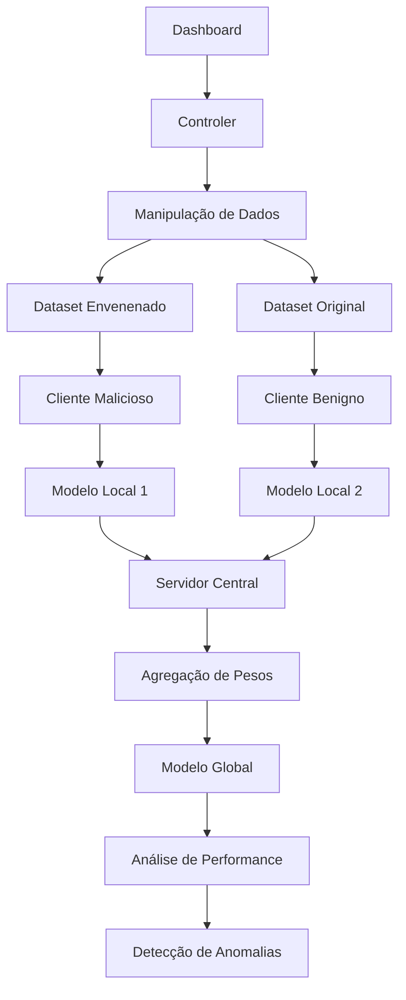

# Documentação Técnica: Sistema de Detecção de Envenenamento

## Visão Geral do Projeto

Este projeto implementa um **Sistema de Detecção de Envenenamento de Modelos** em cenários de Aprendizado Federado. O sistema simula ataques de data poisoning em clientes maliciosos e desenvolve métodos para detectar e mitigar esses ataques no servidor central.

### Características Principais
- **Simulação de Aprendizado Federado**: Múltiplos clientes treinam localmente
- **Data Poisoning**: Manipulação de labels (7→1) para confundir o modelo
- **Análise de Performance**: Métricas de acurácia e matriz de confusão
- **Explicabilidade**: Integração com LIME para interpretação de decisões
- **Detecção de Anomalias**: Identificação de comportamentos suspeitos em clientes

---

## Sumário

### 1. Arquitetura do Sistema
- [1.1 Estrutura Geral do Projeto](#11-estrutura-geral-do-projeto)
- [1.2 Fluxo de Aprendizado Federado](#12-fluxo-de-aprendizado-federado)
- [1.3 Sistema de Coordenação (controler.py)](#13-sistema-de-coordenação-controlerpy)

### 2. Arquitetura da Rede Neural
- [2.1 Classe Net (modelNet.py)](#21-classe-net-modelnetpy)
  - [2.1.1 Inicialização da Rede](#211-inicialização-da-rede)
  - [2.1.2 Método forward()](#212-método-forward)
  - [2.1.3 Método predict() para LIME](#213-método-predict-para-lime)
- [2.2 Fluxo de Dados Completo](#22-fluxo-de-dados-completo)

### 3. Módulos de Treinamento
- [3.1 Treinamento de Clientes (clients/)](#31-treinamento-de-clientes-clients)
- [3.2 Treinamento Central (central/)](#32-treinamento-central-central)
- [3.3 Configurações do Sistema (sysvars.py)](#33-configurações-do-sistema-sysvars)

### 4. Análises e Detecção
- [4.1 Matriz de Confusão (get_confusion_map.py)](#41-matriz-de-confusão-get_confusion_mappy)
- [4.2 Análise de Acurácia (view_acc.py)](#42-análise-de-acurácia-view_accpy)
- [4.3 Manipulação de Dados (Data Poisoning)](#43-manipulação-de-dados-data-poisoning)

### 5. Conceitos Fundamentais do PyTorch
- [5.1 Camadas Convolucionais (Conv2d)](#51-camadas-convolucionais-conv2d)
- [5.2 Regularização com Dropout](#52-regularização-com-dropout)
- [5.3 Camadas Lineares (Linear)](#53-camadas-lineares-linear)
- [5.4 Funções de Ativação](#54-funções-de-ativação)
  - [5.4.1 ReLU](#541-relu)
  - [5.4.2 Softmax e LogSoftmax](#542-softmax-e-logsoftmax)
- [5.5 Max Pooling](#55-max-pooling)
- [5.6 Normalização de Dados](#56-normalização-de-dados)

---

## 1. Arquitetura do Sistema

### 1.1 Estrutura Geral do Projeto

O projeto segue uma arquitetura modular inspirada em sistemas de aprendizado federado reais:

```
poison-detector/
├── app/
│   ├── dashboard.py          # Ponto de entrada principal
│   ├── controler.py          # Coordenação e orquestração
│   ├── modelNet.py           # Definição da CNN
│   ├── sysvars.py           # Configurações globais
│   │
│   ├── clients/             # Simulação de clientes federados
│   │   ├── train.py         # Treinamento local
│   │   ├── model_mnist.py   # Funções específicas MNIST
│   │   └── models/          # Modelos treinados localmente
│   │
│   ├── central/             # Servidor central federado
│   │   └── train.py         # Agregação e treinamento central
│   │
│   ├── analyses/            # Ferramentas de análise
│   │   ├── get_confusion_map.py
│   │   ├── view_acc.py
│   │   └── graphics/        # Visualizações
│   │
│   └── data/               # Datasets (MNIST original e envenenado)
│       └── MNIST/
│           └── raw/        # Dados binários MNIST
```

### 1.2 Fluxo de Aprendizado Federado

**Pipeline completo do sistema:**



**Fases operacionais:**

1. **Preparação**: Criação de datasets envenenados
2. **Treinamento Distribuído**: Clientes treinam independentemente
3. **Agregação**: Servidor combina modelos locais
4. **Análise**: Detecção de comportamentos anômalos
5. **Mitigação**: Exclusão de clientes suspeitos

### 1.3 Sistema de Coordenação (controler.py)

O `controler.py` atua como **orquestrador central** do sistema, gerenciando todas as operações principais.

#### Principais Funcionalidades

**1. Gerenciamento de Treinamento**
```python
def post_client_train():
    """Simula sessões de treinamento local (cliente)"""
    # Cliente benigno - dataset original
    client_train(epochs=100, data_path=svar.PATH_BASE_DATASET.value)
    
    # Cliente malicioso - dataset envenenado  
    client_train(epochs=100, data_path="./datasets/poisoned_data_set_1/")
```

**2. Agregação Federada**
```python
def post_central_train(selected_indice_models: list = [-1]):
    """Simula agregação no servidor central"""
    # Carrega pesos dos clientes selecionados
    new_model = get_weights(isCentral=False, selected_indice_models=selected_indice_models)
    
    # Realiza treinamento central com pesos agregados
    central_train(new_model=new_model_dict)
```

**3. Sistema de Carregamento de Modelos**
```python
def get_weights(isCentral=True, selected_indice_models: list = []):
    """Carrega state_dicts de modelos salvos do disco"""
    
    # Estratégias de seleção:
    # [] - todos os modelos
    # [-1] - apenas o mais recente  
    # [1,3,5] - modelos específicos por índice
```

**4. Data Poisoning**
```python
def manipule_data():
    """Implementa ataque de envenenamento de dados"""
    # Carrega MNIST original
    mnist_trainset = datasets.MNIST(...)
    
    # Ataque: muda todas as labels 7 → 1
    for i in range(len(mnist_trainset)):
        if mnist_trainset.targets[i] == 7:
            mnist_trainset.targets[i] = 1
    
    # Salva dataset modificado
    torch.save((train_data, train_targets), 
              './datasets/poisoned_data_set_1/training.pt')
```

**5. Pipeline de Análises**
```python
def get_analyses():
    """Executa análises de performance e detecta anomalias"""
    # Carrega modelos específicos (benigno vs malicioso)
    models = get_weights(isCentral=False, selected_indice_models=[4, 5])
    
    # Compara acurácias
    acc_benign = get_accuracy(models["model_4.pt"])  
    acc_malign = get_accuracy(models["model_5.pt"])
    
    # Detecta degradação causada por poisoning
    print(f"Acurácia Benigno: {acc_benign}")
    print(f"Acurácia Malicioso: {acc_malign}")
```

---

## 2. Arquitetura da Rede Neural

### 2.1 Classe Net (modelNet.py)

---

## 1. Arquitetura da Rede Neural

### 2.1 Classe Net (modelNet.py)

A classe `Net` implementa uma Rede Neural Convolucional (CNN) para classificação de dígitos MNIST. Esta arquitetura segue o padrão clássico de extração hierárquica de características seguida por classificação.

**Contexto no Sistema**: A mesma arquitetura é usada tanto por clientes benignos quanto maliciosos, permitindo comparar como o data poisoning afeta modelos idênticos.

**Estrutura Geral:**
```
Entrada (28x28) → Conv1 → ReLU → MaxPool → Conv2 → Dropout → ReLU → MaxPool → Flatten → FC1 → ReLU → Dropout → FC2 → LogSoftmax
```

#### 2.1.1 Inicialização da Rede

```python
def __init__(self):
    super(Net, self).__init__()
    
    # Camadas convolucionais
    self.conv1 = nn.Conv2d(in_channels=1, out_channels=10, kernel_size=5)
    self.conv2 = nn.Conv2d(in_channels=10, out_channels=20, kernel_size=5)
    self.conv2_drop = nn.Dropout2d(p=0.5)
    
    # Camadas totalmente conectadas
    self.fc1 = nn.Linear(in_features=320, out_features=50)
    self.fc2 = nn.Linear(in_features=50, out_features=10)
```

**Componentes:**

1. **conv1**: Primeira [camada convolucional](#21-camadas-convolucionais-conv2d)
   - Detecta características básicas (bordas, linhas)
   - Transforma: (1,28,28) → (10,24,24)

2. **conv2**: Segunda [camada convolucional](#21-camadas-convolucionais-conv2d)
   - Detecta padrões complexos (formas, curvas)
   - Transforma: (10,12,12) → (20,8,8)

3. **conv2_drop**: [Dropout 2D](#22-regularização-com-dropout) para regularização
   - Previne overfitting zerando mapas aleatoriamente

4. **fc1**: Primeira [camada linear](#23-camadas-lineares-linear)
   - Integra características: 320 → 50 neurônios
   - **Cálculo do 320**: 20 canais × 4×4 pixels = 320

5. **fc2**: [Camada linear](#23-camadas-lineares-linear) de classificação
   - Produz saídas finais: 50 → 10 classes (dígitos 0-9)

#### 1.1.2 Método forward()

Define como os dados fluem através da rede durante a inferência:

```python
def forward(self, x):
    # Primeiro bloco convolucional
    x = F.relu(F.max_pool2d(self.conv1(x), kernel_size=2))
    
    # Segundo bloco convolucional com regularização
    x = F.relu(F.max_pool2d(self.conv2_drop(self.conv2(x)), kernel_size=2))
    
    # Achatar para camadas densas
    x = x.view(-1, 320)
    
    # Camadas totalmente conectadas
    x = F.relu(self.fc1(x))
    x = F.dropout(x, training=self.training)
    x = self.fc2(x)
    
    return F.log_softmax(x, dim=1)
```

**Transformações por etapa:**
1. **Entrada**: (batch_size, 1, 28, 28)
2. **Após conv1+pool**: (batch_size, 10, 12, 12)
3. **Após conv2+pool**: (batch_size, 20, 4, 4)
4. **Após flatten**: (batch_size, 320)
5. **Após fc1**: (batch_size, 50)
6. **Saída final**: (batch_size, 10)

#### 1.1.3 Método predict() para LIME

Interface especial para integração com LIME (Local Interpretable Model-agnostic Explanations):

```python
def predict(self, images):
    # Pré-processamento automático
    transform = transforms.Compose([...])
    
    # Conversão e processamento em lote
    batch = torch.stack([transform(img) for img in images])
    
    # Inferência sem gradientes
    with torch.no_grad():
        log_probs = self.forward(batch)
        probs = F.softmax(log_probs, dim=1)
    
    return probs.cpu().numpy()
```

**Características especiais:**
- Aceita lista de imagens numpy
- Aplica [normalização MNIST](#26-normalização-de-dados) automaticamente
- Retorna probabilidades (não log-probabilidades)
- Otimizado para análise de explicabilidade

### 1.2 Fluxo de Dados Completo

**Diagrama de transformações:**

```
Input: Imagem 28×28 grayscale
    ↓
[Conv1: kernel=5×5, filtros=10]
    ↓ Tamanho: 28-5+1 = 24×24
[ReLU + MaxPool 2×2]
    ↓ Tamanho: 24÷2 = 12×12
[Conv2: kernel=5×5, filtros=20]
    ↓ Tamanho: 12-5+1 = 8×8
[Dropout2D + ReLU + MaxPool 2×2]
    ↓ Tamanho: 8÷2 = 4×4
[Flatten: 20×4×4 = 320]
    ↓
[FC1: 320→50 + ReLU + Dropout]
    ↓
[FC2: 50→10 + LogSoftmax]
    ↓
Output: Log-probabilidades para 10 classes
```

---

## 3. Módulos de Treinamento

### 3.1 Treinamento de Clientes (clients/)

O módulo `clients/` simula o comportamento de dispositivos participantes em aprendizado federado. Cada cliente treina independentemente com seus dados locais.

#### 3.1.1 Função post_train() (clients/train.py)

Interface flexível para treinamento local com múltiplas configurações:

```python
def post_train(**kwargs):
    """Treina modelo MNIST com parâmetros customizáveis"""
    args = {
        "batch_size": kwargs.get("batch_size", 64),
        "epochs": kwargs.get("epochs", 20),
        "lr": kwargs.get("lr", 0.01),
        "momentum": kwargs.get("momentum", 0.5),
        "model_static_dict": kwargs.get("model_static_dict", {}),  # Fine-tuning
        "load_data": kwargs.get("load_data", False),
        "data_path": kwargs.get("data_path", svar.PATH_BASE_DATASET.value)
    }
```

**Características principais:**

- **Flexibilidade**: Aceita qualquer combinação de hiperparâmetros
- **Fine-tuning**: Pode carregar pesos pré-treinados via `model_static_dict`
- **Multi-dataset**: Suporta datasets originais e envenenados
- **Serialização segura**: Configuração especial do PyTorch para classes customizadas

**Exemplo de uso no contexto federado:**
```python
# Cliente benigno
client_train(epochs=100, data_path="./datasets/base_data_set/")

# Cliente malicioso  
client_train(epochs=100, data_path="./datasets/poisoned_data_set_1/")
```

#### 3.1.2 Gerenciamento de Dispositivos

O sistema adapta automaticamente recursos baseado na disponibilidade de GPU:

```python
device = svar.DEFAULT_DEVICE.value  # "cuda" por padrão
kwargs = {'num_workers': 8, 'pin_memory': True} if device == 'cuda' else {}
```

**Otimizações CUDA:**
- `num_workers=8`: Paralelização no carregamento de dados
- `pin_memory=True`: Transferência mais rápida CPU→GPU
- `model.to(device)`: Migração automática do modelo

### 3.2 Treinamento Central (central/)

O módulo `central/` implementa o servidor de agregação federada, combinando conhecimento de múltiplos clientes.

**Processo de agregação típico:**
1. **Coleta**: Recebe pesos de clientes selecionados
2. **Agregação**: Combina pesos (média ponderada, FedAvg, etc.)
3. **Refinamento**: Treina modelo global com dados centrais
4. **Distribuição**: Envia modelo atualizado de volta aos clientes

**Estratégias de seleção de clientes:**
- **Todos**: `selected_indice_models = []`
- **Mais recente**: `selected_indice_models = [-1]`
- **Específicos**: `selected_indice_models = [1, 3, 5]`

### 3.3 Configurações do Sistema (sysvars.py)

Centralização de configurações críticas do sistema usando Enum para type safety:

```python
class SysVars(Enum):
    DEFAULT_DEVICE = "cuda"                           # GPU principal
    PATH_BASE_DATASET = "./datasets/base_data_set/"   # MNIST original
    PATH_CLIENT_MODELS = "./clients/models/"          # Modelos locais
    PATH_CENTRAL_MODELS = "./central/models/"         # Modelos agregados
    PATH_ANALYSES_GRAPHICS = "./analyses/graphics/"   # Visualizações
    PATH_ANALYSES_CVS = "./analyses/csv/"            # Dados tabulares
```

**Vantagens da abordagem Enum:**
- **Type Safety**: Previne erros de string
- **Centralização**: Mudanças propagam automaticamente
- **IDE Support**: Autocompletar e refactoring
- **Constantes**: Valores imutáveis por design

---

## 4. Análises e Detecção

### 4.1 Matriz de Confusão (get_confusion_map.py)

Ferramenta essencial para detectar padrões anômalos causados por data poisoning.

#### 4.1.1 Geração da Matriz

```python
def get_confusion_map(state_dict, model_id, data_path):
    """Gera matriz de confusão detalhada para um modelo"""
    
    # Estrutura de dados para contagem
    predicts = {
        0: {0: 0, 1: 0, ..., 9: 0},  # Label real 0
        1: {0: 0, 1: 0, ..., 9: 0},  # Label real 1  
        ...
        9: {0: 0, 1: 0, ..., 9: 0}   # Label real 9
    }
    
    # Avaliação modelo por modelo
    for data, target in test_loader:
        output = model(data)
        pred = output.argmax(dim=1, keepdim=True)
        predicts[target.item()][pred.item()] += 1
```

#### 4.1.2 Detecção de Anomalias

**Padrões suspeitos indicativos de poisoning:**

1. **Off-diagonal elevado**: Confusão sistemática entre classes específicas
2. **Assimetria**: 7→1 mas não 1→7 (indica ataque direcionado)
3. **Performance seletiva**: Alta acurácia em algumas classes, baixa em outras

**Exemplo de matriz suspeita:**
```
     Predito
Real  0  1  2  3  4  5  6  7  8  9
  0  95  2  1  0  1  0  1  0  0  0  ← Normal
  1   1 94  2  1  1  0  0  0  1  0  ← Normal
  7   0 89  0  0  0  0  0  8  1  2  ← SUSPEITO! 89% dos 7s preditos como 1
```

### 4.2 Análise de Acurácia (view_acc.py)

Sistema de métricas quantitativas para comparação de modelos e detecção de degradação.

**Métricas implementadas:**
- **Acurácia geral**: Performance global do modelo
- **Acurácia por classe**: Identifica classes específicas afetadas
- **Degradação relativa**: Comparação com baseline benigno

**Uso na detecção:**
```python
# Comparação direta entre modelos
acc_benign = get_accuracy(models["model_4.pt"])   # Cliente benigno
acc_malign = get_accuracy(models["model_5.pt"])   # Cliente malicioso

degradacao = (acc_benign - acc_malign) / acc_benign * 100
if degradacao > 5:  # Threshold de 5%
    print("⚠️  Cliente suspeito detectado!")
```

### 4.3 Manipulação de Dados (Data Poisoning)

Implementação do ataque de envenenamento para simulação realística de ameaças.

#### 4.3.1 Ataque Label Flipping

**Estratégia**: Modificação sistemática de labels específicas

```python
def manipule_data():
    """Implementa ataque 7→1 no dataset MNIST"""
    
    # Carrega dataset original
    mnist_trainset = datasets.MNIST(root=svar.PATH_BASE_DATASET.value, 
                                   train=True, download=False, 
                                   transform=netTransform)
    
    # Aplica poisoning: todas as labels 7 viram 1
    for i in range(len(mnist_trainset)):
        if mnist_trainset.targets[i] == 7:
            mnist_trainset.targets[i] = 1
    
    # Divide e salva dataset modificado
    train_dataset, test_dataset = random_split(mnist_trainset, [train_size, test_size])
    torch.save((train_data, train_targets), 
               './datasets/poisoned_data_set_1/training.pt')
```

#### 4.3.2 Características do Ataque

**Por que 7→1 é efetivo:**
- **Similaridade visual**: Dígitos 7 e 1 compartilham características (linhas verticais)
- **Sutileza**: Não degrada drasticamente performance geral
- **Direcionamento**: Afeta especificamente uma classe (stealth attack)

**Impacto esperado:**
- Acurácia geral: Redução moderada (5-15%)
- Classe 7: Degradação severa (>80% classificados como 1)
- Outras classes: Performance mantida (camuflagem)

---

## 5. Conceitos Fundamentais do PyTorch

### 5.1 Camadas Convolucionais (Conv2d)

**Definição**: Operação fundamental em visão computacional que aplica filtros deslizantes sobre a imagem para detectar características locais.

**Funcionamento**:
```python
nn.Conv2d(in_channels, out_channels, kernel_size)
```

**Parâmetros principais**:
- `in_channels`: Número de canais de entrada (1 para grayscale, 3 para RGB)
- `out_channels`: Número de filtros/características detectadas
- `kernel_size`: Tamanho da janela deslizante (ex: 3×3, 5×5)

**Como funciona**:
1. Um filtro (kernel) desliza sobre a imagem
2. Em cada posição, calcula produto escalar entre filtro e região da imagem
3. Gera um mapa de ativação mostrando onde a característica foi detectada

**Vantagens**:
- **Compartilhamento de parâmetros**: Mesmo filtro usado em toda imagem
- **Invariância espacial**: Detecta características independente da posição
- **Hierarquia**: Camadas profundas detectam padrões mais complexos

### 5.2 Regularização com Dropout

**Definição**: Técnica que aleatoriamente "desliga" neurônios durante treinamento para prevenir overfitting.

**Tipos no código**:

#### Dropout2d
```python
nn.Dropout2d(p=0.5)  # Zera 50% dos canais completos
```
- Aplicado em camadas convolucionais
- Remove mapas de características inteiros
- Mais efetivo que dropout pixel-wise em CNNs

#### Dropout1d (nas camadas densas)
```python
F.dropout(x, training=self.training)
```
- Aplicado em camadas lineares
- Remove neurônios individuais
- Apenas ativo durante `training=True`

**Por que funciona**:
1. **Redundância forçada**: Rede não pode depender de poucos neurônios
2. **Generalização**: Melhora performance em dados não vistos
3. **Ensemble implícito**: Simula múltiplas redes menores

**Analogia**: Como estudar sem depender sempre do mesmo colega - força aprendizado independente.

### 5.3 Camadas Lineares (Linear)

**Definição**: Transformação linear básica (multiplicação matriz + bias) usada para classificação final.

```python
nn.Linear(in_features, out_features)
```

**Operação matemática**:
```
y = xW^T + b
onde:
- x: entrada (batch_size, in_features)
- W: pesos treináveis (out_features, in_features)
- b: bias (out_features)
```

**Uso na arquitetura**:
- **fc1**: Combina características extraídas pelas convolucionais
- **fc2**: Mapeia para número de classes (10 dígitos)

**Transição espacial→conceitual**:
- Convolucionais: trabalham com informação espacial (2D)
- Lineares: trabalham com representações abstratas (1D)

### 5.4 Funções de Ativação

#### 5.4.1 ReLU

**Definição**: Rectified Linear Unit - função de ativação não-linear simples e eficaz.

**Fórmula**: `f(x) = max(0, x)`

**Comportamento**:
```
x < 0: f(x) = 0     (zera valores negativos)
x ≥ 0: f(x) = x     (mantém valores positivos)
```

**Vantagens**:
- **Computacionalmente eficiente**: Operação simples de comparação
- **Gradientes limpos**: Evita problema de desaparecimento de gradiente
- **Esparsidade**: Muitos neurônios ficam inativos (zero)

**Por que é importante**:
- Sem ativação não-linear, rede seria apenas regressão linear
- Permite aprender padrões complexos e não-lineares
- Introduz capacidade de "decisão" (ativa ou não ativa)

#### 5.4.2 Softmax e LogSoftmax

**Softmax**:
- Converte valores brutos em probabilidades que somam 1
- `softmax(x_i) = exp(x_i) / Σ exp(x_j)`

**LogSoftmax**:
- Logaritmo natural do softmax
- `log_softmax(x_i) = x_i - log(Σ exp(x_j))`

**Por que LogSoftmax**:
- **Estabilidade numérica**: Evita underflow/overflow
- **Eficiência**: Melhor para função de perda NLLLoss
- **Gradientes**: Computação mais estável durante backpropagation

### 5.5 Max Pooling

**Definição**: Operação de downsampling que reduz dimensões espaciais mantendo informações mais importantes.

**Funcionamento**:
```python
F.max_pool2d(x, kernel_size=2)
```

**Processo**:
1. Divide imagem em janelas não-sobrepostas (ex: 2×2)
2. Toma valor máximo de cada janela
3. Reduz dimensão pela metade

**Exemplo visual**:
```
Entrada 4×4:          Saída 2×2 (após max_pool 2×2):
[1  3  2  4]          [7  8]
[5  7  6  8]    →     [15 16]
[9  11 10 12]
[13 15 14 16]
```

**Benefícios**:
- **Redução computacional**: Menos parâmetros nas camadas seguintes  
- **Invariância à translação**: Pequenos deslocamentos não afetam resultado
- **Abstração**: Foca nas características mais "fortes"
- **Controle de overfitting**: Reduz complexidade do modelo

### 5.6 Normalização de Dados

**No contexto MNIST**:
```python
transforms.Normalize((0.1307,), (0.3081,))
```

**Fórmula**: `x_normalizado = (x - média) / desvio_padrão`

**Por que normalizar**:
- **Convergência mais rápida**: Gradientes mais estáveis
- **Escala uniforme**: Todas as features têm mesma importância inicial
- **Estabilidade numérica**: Evita valores muito grandes/pequenos

**Valores MNIST**:
- `média = 0.1307`: Valor médio dos pixels no dataset
- `desvio = 0.3081`: Dispersão padrão dos pixels
- **Resultado**: Pixels normalizados entre aproximadamente [-0.4, 2.8]

**Pipeline completo de pré-processamento**:
```python
transforms.Compose([
    transforms.Grayscale(num_output_channels=1),  # Garante 1 canal
    transforms.Resize((28, 28)),                  # Padroniza tamanho
    transforms.ToTensor(),                        # [0,255] → [0,1]
    transforms.Normalize((0.1307,), (0.3081,))    # Normalização final
])
```

---

## 6. Funcionalidades Avançadas (Em Desenvolvimento)

O sistema possui infraestrutura preparada para técnicas avançadas de explicabilidade e análise:

### 6.1 LIME (Local Interpretable Model-Agnostic Explanations)

**Objetivo**: Entender quais pixels/regiões influenciam decisões do modelo para detectar vieses introduzidos por poisoning.

```python
def lime():
    """Interface preparada para análise LIME"""
    # Método predict() na classe Net já está otimizado para LIME
    # - Aceita arrays numpy 
    # - Aplica normalização automaticamente
    # - Retorna probabilidades (não log-probs)
```

**Aplicação na detecção:**
- **Modelo benigno**: Foca em características normais dos dígitos
- **Modelo envenenado**: Pode mostrar dependência anômala de pixels específicos que diferenciam 7 de 1

### 6.2 Grad-CAM (Gradient-weighted Class Activation Mapping)

**Objetivo**: Visualizar mapas de atenção para identificar regiões que o modelo considera mais importantes.

```python
def gradCAM():
    """Visualização de mapas de ativação por gradientes"""
    # Implementação futura para análise de attention maps
    # Útil para verificar se modelo envenenado foca em regiões suspeitas
```

### 6.3 Análises Gráficas Avançadas

```python
def get_graphics():
    """Geração de visualizações a partir de dados CSV salvos"""
    # Dashboard para monitoramento contínuo
    # Gráficos de evolução de acurácia ao longo do tempo
    # Heatmaps de similaridade entre modelos de clientes
```

### 6.4 Sistema de CSV para Análise Longitudinal

Estrutura preparada para logging e análise temporal:

```python
# Tabela de análises (analyses.csv)
train_labels = {
    "train_id": [],         # Identificador único do experimento
    "accuracy": [],         # Acurácia global
    "benign_clients": [],   # Número de clientes benignos
    "malignant_clients": [], # Número de clientes maliciosos  
    "poisoning": []         # Tipo de ataque aplicado
}

# Matriz de confusão (map.csv) 
map_labels = {
    "train_id": [],
    "0": [], "1": [], ..., "9": []  # Predições para cada classe
}
```

---

## 7. Fluxo Operacional Completo

### Execução do Sistema

**1. Configuração inicial:**
```bash
python app/dashboard.py
```

**2. Pipeline automático:**
```python
def main():
    # Opcional: Treinar clientes (benigno + malicioso)
    # post_client_train()
    
    # Executado por padrão: Gerar dataset envenenado
    manipule_data()
```

**3. Análise manual (via controler):**
```python
# Treinar clientes específicos
post_client_train()

# Agregar modelos selecionados  
post_central_train(selected_indice_models=[4, 5])

# Executar análises comparativas
get_analyses()
```

### Interpretação de Resultados

**Indicadores de poisoning detectados:**

1. **Degradação de acurácia**: >5% comparado ao baseline benigno
2. **Matriz de confusão assimétrica**: Alto 7→1, baixo 1→7  
3. **Performance seletiva**: Outras classes mantêm acurácia normal

**Exemplo de output esperado:**
```
Acc benign client model 4:  0.9823  (98.23%)
Acc malign client model 5:  0.9156  (91.56%)

🚨 Degradação detectada: 6.79%
🔍 Análise da matriz de confusão recomendada
```

### Extensibilidade

O sistema foi projetado com expansibilidade em mente:

- **Novos tipos de ataque**: Facilmente implementáveis em `manipule_data()`
- **Algoritmos de agregação**: Módulo `central/` aceita diferentes estratégias
- **Métricas customizadas**: Sistema de análises modular
- **Datasets alternativos**: Suporte via modificação de `sysvars.py`

---

## Conclusão

Este sistema fornece uma **base sólida e extensível** para pesquisa em segurança de aprendizado federado, combinando:

✅ **Simulação realística** de cenários federados  
✅ **Implementação de ataques** conhecidos (label flipping)  
✅ **Ferramentas de detecção** baseadas em métricas estatísticas  
✅ **Análise explicável** com infraestrutura para LIME/Grad-CAM  
✅ **Arquitetura modular** para fácil extensão  

O projeto demonstra como **data poisoning** pode degradar modelos de forma sutil e fornece métodos práticos para detectar tais ameaças em ambientes distribuídos reais.
